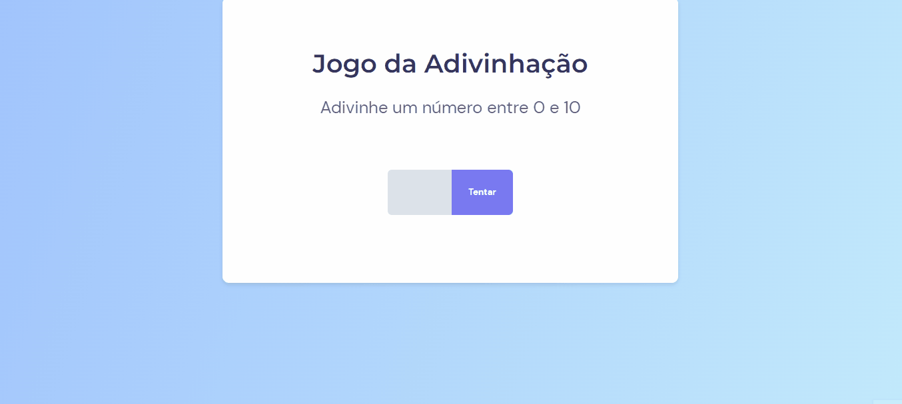

## 💻 Projeto

Desafio que consistia em  criar um "adivinhador" de números de 0 a 10

## 🚀 Tecnologias

<ul>
  <li>HTML</li>
  <li>CSS</li>
  <li>Javascript</li>
</ul>

## 🔖 Layout do Projeto

O layout pode ser visto através do Figma

[Layout Web](https://www.figma.com/file/bc4GPBzYjblfYO5tM2TxJe/Jogo-Adivinha%C3%A7%C3%A3o-(Copy)?node-id=0%3A1&t=lfW11c6rVqfpuuMV-0)
